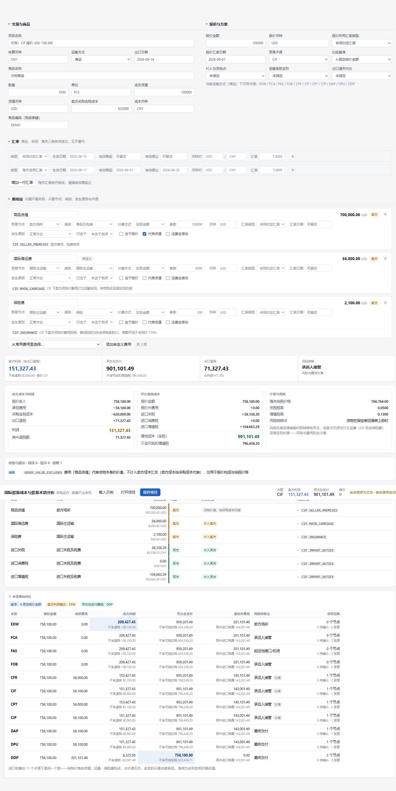

# 国际贸易成本与贸易术语方案分析系统

输入一笔出口交易和各项费用，系统按 Incoterms 2020 判断每笔费用由谁承担，
算出买卖双方的成本与利润，并横向比较 11 种贸易术语。

**不联网、不登录、不上传。所有数据留在你自己电脑上。**



---

## 怎么打开

**方式一（推荐）**：下载本仓库根目录下的 `trade-cost-engine.html`，双击打开。不需要安装任何东西。

**方式二**：打开本仓库页面后点 `Code` → `Download ZIP`，解压后同样双击那个文件。

想发给别人，直接把这一个文件发过去就行——样式和脚本都打包在里面了。

## 三步上手

1. **录商品与费用**：上方填商品、货值、你的采购成本；「费用项」里逐条录实际发生的费用
   （也有现成的常用费用可选，如报关费、订舱费、港杂费、滞箱费）。
2. **填汇率、选术语**：汇率分合同/市场/海关三类，各自独立；「报价与方案」里选贸易术语和比较基准。
3. **看结果**：右侧给出卖方利润、买方落地成本、每笔费用归谁的依据，以及 11 种术语的对比。

改任何一个数字，顶部的关键数字会立刻更新。

## 数据存在哪

| | |
|---|---|
| **项目文件** | 点「保存项目」存成 `.json` 文件，点「打开项目」读回来。这是你的正式存档，可归档、可发邮件 |
| **草稿** | 每次改动自动存在浏览器本地，误关页面不会丢 |
| **注意** | 没有服务器，所以数据不会自动同步到另一台电脑，只能通过项目文件传递 |

## 几条容易误解的口径

- **进口关税和增值税与贸易术语无关。** 完税价格由货值、运费、保险费构成，这三项是交易事实。
  11 种术语下税费总额是同一个数，变的只是由谁来付。
- **跨术语比"报价金额"没有意义。** CIF 报 108,300 和 FOB 报 100,500 谁更好？答案取决于看买方总支付还是卖方利润，所以对比表同时给这两列。
- **"固定报价"和"固定买方总支付"回答的是不同问题。** 前者是"价格不变，我多承担环节会亏多少"；后者是"买方只肯出这个总价，我该报多少、承担到哪一环"。后者下各术语的利润往往趋于一致——这是正常的。
- **出口退税是利润的加项**，不是备注。结果里同时给"不含退税的利润"，一眼看出这单有多少是靠退税撑着的。
- **保险费在 CIF/CIP 下是卖方义务**，保额不低于合同价 110%；漏录会高估利润，系统会提示。

## 已知边界

- **不做**：拖拽打开文件、CSV 批量录入（列错位会造成静默错算，比手工录更危险）、多设备同步。
- **未做**：按完税价格高低二选一的"选择型复合税"（遇到请手工录入税额）。
- **建模上做不到**：同一环节由不同方操作时成本不同（如自营运费低于买方自办）——一个费用项只有一个金额，要评估这种差异得把双方价格录成两条。
- 不支持：多用户协作、审批流、历史版本对比。

### 容量

一笔交易的费用项建议控制在 **100 条以内**。实测（浏览器、本机）：

| 费用项数 | 打开页面 | 改一个数字后重算 |
|---|---|---|
| 50 | 0.5 秒 | 0.07 秒 |
| 150 | 0.3 秒 | 0.45 秒 |
| 300 | 1.4 秒 | 1.7 秒 |

超出这个量级不会算错，只是改完一个数字要等半秒左右。计算本身很快（300 笔费用算完 11 种术语只要 34 毫秒），慢的是把几百张录入卡片重绘一遍。

## 出问题了

- **打开是没样式的裸页面**：重启开发服务器（`npm run dev`）。
- **界面提示"无法计算"**：按提示补全输入即可，引擎不会在缺数据时猜一个结果。
  最常见的原因是缺少对应类型的汇率簿。
- **数字对不上**：对比表上的"进口税费"应与术语无关；如果各术语税费不同，说明数据录错了。

## 给开发者

```bash
npm install
npm run dev        # 开发模式
npm test           # 234 个单测
npm run audit      # 静态审查：未处理的界面字段、声明了却无人产生的编码
npm run typecheck  # 类型检查
npm run build:single   # 生成 trade-cost-engine.html
npm run build      # 生成 dist/ 静态站点
```

设计与决策记录见 `docs/design.md`（含每个决策的理由、修正过的问题、以及为什么这么选）。
一份完整的样例输出见 `docs/sample-output.txt`。
